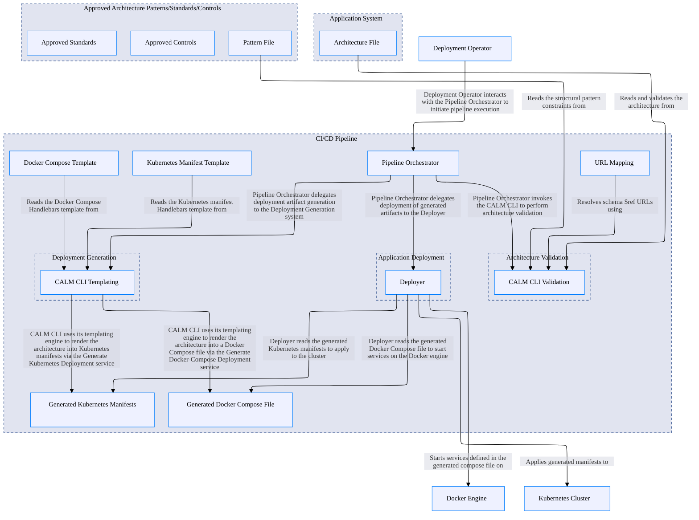

## Architecture Overview

## Nodes
### Name: Deployment Operator  Type: actor

Developer or CI runner that invokes the validate-and-deploy script

---
### Name: CI/CD Pipeline  Type: system

System that packages the CALM CLI, template data assets, and URL mapping used for architecture validation and rendering

---
### Name: Approved Architecture Patterns/Standards/Controls  Type: system

System that groups the approved architecture and pattern artifacts used as the source of truth for validation

---
### Name: Application System  Type: system

System representing the application architecture definition that is validated and deployed by the CI/CD process

---
### Name: Pipeline Orchestrator  Type: service

Service that orchestrates the validate-and-deploy pipeline steps on behalf of the Deployment Operator

---
### Name: Deployer  Type: service

Service responsible for applying generated deployment artifacts to the target infrastructure

---
### Name: CALM CLI Validation  Type: service

FINOS CALM CLI tool that validates architectures against approved patterns and renders architecture templates into deployment manifests

---
### Name: Architecture File  Type: data-asset

CALM architecture JSON file describing the system to be deployed (e.g. my-fullstack-k8s.architecture.json)

---
### Name: Pattern File  Type: data-asset

CALM pattern JSON file defining the structural constraints the architecture must conform to (docs/calm/patterns/my-fullstack.pattern.json)

---
### Name: Approved Standards  Type: data-asset

Approved standards artifacts used as part of the source of truth for architecture validation

---
### Name: Approved Controls  Type: data-asset

Approved control artifacts used as part of the source of truth for architecture validation

---
### Name: URL Mapping  Type: data-asset

JSON file mapping schema $ref URLs to local file paths, used during validation (docs/calm/url-mapping.json)

---
### Name: Kubernetes Manifest Template  Type: data-asset

Handlebars template rendered by the CALM CLI into a Kubernetes manifest file (docs/calm/templates/k8s-manifests.yaml.hbs)

---
### Name: Docker Compose Template  Type: data-asset

Handlebars template rendered by the CALM CLI into a Docker Compose file (docs/calm/templates/dc-compose.yaml.hbs)

---
### Name: Generated Kubernetes Manifests  Type: data-asset

Kubernetes manifest YAML file generated from the architecture by the CALM CLI (calm-generated-k8s/all-manifests.yaml)

---
### Name: Generated Docker Compose File  Type: data-asset

Docker Compose YAML file generated from the architecture by the CALM CLI (calm-generated-dc/docker-compose.yml)

---
### Name: Architecture Validation  Type: system

System responsible for validating CALM architecture files against approved patterns and standards using the CALM CLI

---
### Name: Deployment Generation  Type: system

System responsible for generating deployment artifacts (Kubernetes manifests and Docker Compose files) from validated CALM architectures using the CALM CLI

---
### Name: Kubernetes Cluster  Type: system

Target Kubernetes cluster to which manifests are applied via kubectl

---
### Name: Docker Engine  Type: system

Target Docker host on which services are started via docker compose

---
### Name: CALM CLI Templating  Type: service

FINOS CALM CLI templating service that renders architecture definitions into deployment artifacts using Handlebars templates

---
### Name: Application Deployment  Type: system

System responsible for applying generated deployment artifacts to the target infrastructure

---

