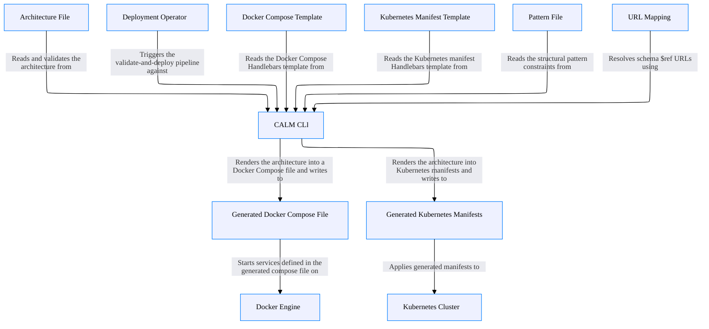

```mermaid
---
config:
  theme: base
  themeVariables:
    fontFamily: -apple-system, BlinkMacSystemFont, 'Segoe WPC', 'Segoe UI', system-ui, 'Ubuntu', sans-serif
    darkMode: false
    fontSize: 14px
    edgeLabelBackground: '#d5d7e1'
    lineColor: '#000000'
---
%%{init: {"layout": "elk", "flowchart": {"htmlLabels": false}}}%%
flowchart TB
classDef boundary fill:#e1e4f0,stroke:#204485,stroke-dasharray: 5 4,stroke-width:1px,color:#000000;
classDef node fill:#eef1ff,stroke:#007dff,stroke-width:1px,color:#000000;
classDef iface fill:#f0f0f0,stroke:#b6b6b6,stroke-width:1px,font-size:10px,color:#000000;
classDef highlight fill:#fdf7ec,stroke:#f0c060,stroke-width:1px,color:#000000;


    architecture-file["Architecture File"]:::node
    calm-cli["CALM CLI"]:::node
    deployment-operator["Deployment Operator"]:::node
    dc-template["Docker Compose Template"]:::node
    docker-engine["Docker Engine"]:::node
    dc-compose-output["Generated Docker Compose File"]:::node
    k8s-manifest-output["Generated Kubernetes Manifests"]:::node
    kubernetes-cluster["Kubernetes Cluster"]:::node
    k8s-template["Kubernetes Manifest Template"]:::node
    pattern-file["Pattern File"]:::node
    url-mapping["URL Mapping"]:::node

    deployment-operator -->|Triggers the validate-and-deploy pipeline against| calm-cli
    architecture-file -->|Reads and validates the architecture from| calm-cli
    pattern-file -->|Reads the structural pattern constraints from| calm-cli
    url-mapping -->|Resolves schema $ref URLs using| calm-cli
    k8s-template -->|Reads the Kubernetes manifest Handlebars template from| calm-cli
    dc-template -->|Reads the Docker Compose Handlebars template from| calm-cli
    calm-cli -->|Renders the architecture into Kubernetes manifests and writes to| k8s-manifest-output
    calm-cli -->|Renders the architecture into a Docker Compose file and writes to| dc-compose-output
    k8s-manifest-output -->|Applies generated manifests to| kubernetes-cluster
    dc-compose-output -->|Starts services defined in the generated compose file on| docker-engine


```