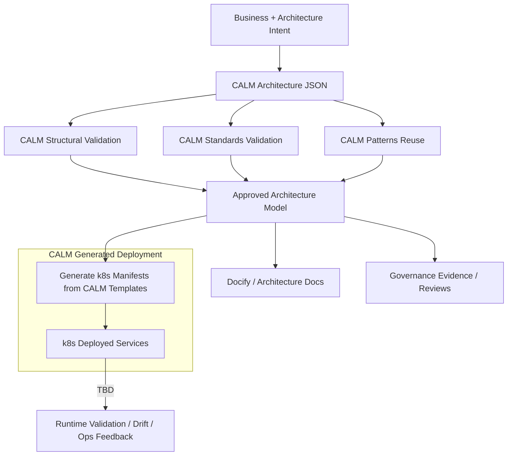

# Architecture Validation Step for CI/CD

## CALM-Driven Kubernetes Deployment Flow

The following diagram illustrates possible process for generating and deploying Kubernetes manifests from a validated CALM architecture.  

- **Business & Architecture Intent**: The process begins with capturing business and architecture requirements, which are formalized as a CALM Architecture JSON document.
- **Validation Steps**: The architecture undergoes three types of validation:
  - *Structural Validation*: Ensures the architecture is structurally sound.
  - *Standards Validation*: Checks compliance with organizational or technical standards.
  - *Pattern Reuse*: Validates the use of reusable architecture patterns.
- **Approval**: Successful validation produces an approved architecture model.
- **Manifest Generation**: The approved model is used to generate Kubernetes manifests using CALM templates, ensuring infrastructure-as-code is consistent with the validated design.
- **Documentation & Governance**: Simultaneously, documentation and governance evidence are produced from the approved model.
- **Deployment**: The generated manifests are applied to the Kubernetes cluster (e.g., via `kubectl apply`), resulting in deployed services.
- **Runtime Validation & Feedback**: Operational feedback and runtime validation (such as drift detection or ops feedback) are collected from the running environment, closing the loop for continuous improvement.

This flow ensures that Kubernetes deployments are always traceable to validated architecture models, with automated documentation and governance, and supports feedback-driven iteration.



The steps described in the `CALM Generated Deployment` are scoped for deploying to a k8s cluster running on a MacOS desktop.  The k8s manifest approach was chosen for this write-up because it was the easiest and fastest to implement in the available run-time.  

For Cloud-based deployments, other tools such as Cloud Formation Templates (CFT) and HELM charts are required.  

The **key point** is that the possibility exists of using the CALM Templating process to provide required values from the CALM architecture metadata to drive these other tools used for deployment.

To illustrate this process, here are two runs of validating and architecture prior to deploying an application to a k8s cluster.

### Invalid architecture

There are two issues with [this architecture](./calm/my-fullstack-invalid.architecture.json):
- Missing required metadata (docker image name) for the backend node.
- Invalid node name in a relationship

Validation is done by [this bash script](../calm-validate-and-deploy.sh).
```
$ ./calm-validate-and-deploy.sh docs/calm/my-fullstack-invalid.architecture.json 
==> Validating architecture against pattern...
Architecture: docs/calm/my-fullstack-invalid.architecture.json
Pattern: docs/calm/patterns/my-fullstack.pattern.json
URL Mapping: docs/calm/url-mapping.json

✗ CALM validation command failed!

(node:55319) [DEP0040] DeprecationWarning: The `punycode` module is deprecated. Please use a userland alternative instead.
(Use `node --trace-deprecation ...` to show where the warning was created)
info [file-system-document-loader]:     docs/calm/my-fullstack-invalid.architecture.json exists, loading as file...
info [file-system-document-loader]:     docs/calm/patterns/my-fullstack.pattern.json exists, loading as file...
info [calm-validate]:     Formatting output as json
{
    "jsonSchemaValidationOutputs": [
        {
            "code": "json-schema",
            "severity": "error",
            "message": "must have required property 'image'",
            "path": "/nodes/backend-api-service/metadata/k8s",
            "schemaPath": "https://my-fullstack-app.example.com/standards/k8s-service-metadata.json/properties/k8s/required",
            "line_start": 93,
            "line_end": 125,
            "character_start": 23,
            "character_end": 17,
            "source": "architecture"
        },
        {
            "code": "json-schema",
            "severity": "error",
            "message": "must match \"then\" schema",
            "path": "/nodes/backend-api-service",
            "schemaPath": "#/properties/nodes/items/if",
            "line_start": 64,
            "line_end": 127,
            "character_start": 8,
            "character_end": 9,
            "source": "architecture"
        }
    ],
    "spectralSchemaValidationOutputs": [
        {
            "code": "composition-relationships-reference-existing-nodes-in-architecture",
            "severity": "error",
            "message": "'backend-api-service-bad-name' does not refer to the unique-id of an existing node.",
            "path": "/relationships/calculator-app-composition/relationship-type/composed-of/nodes/1",
            "schemaPath": "",
            "line_start": 164,
            "line_end": 164,
            "character_start": 50,
            "character_end": 80,
            "source": "architecture"
        }
    ],
    "hasErrors": true,
    "hasWarnings": false
}
```

### Valid architecture

This [architecture](./calm/my-fullstack.architecture.json) passes the development organization's standard for [required metadata](./calm/standards/my-fullstack.standard.json).  The standard is part of development organization's [approved pattern](./calm/patterns/my-fullstack.pattern.json).

Running [the same bash script](../calm-validate-and-deploy.sh) as before we see validation of the architecture and deployment of the application to the k8s cluster.

```
$ ./calm-validate-and-deploy.sh docs/calm/my-fullstack.architecture.json 
==> Validating architecture against pattern...
Architecture: docs/calm/my-fullstack.architecture.json
Pattern: docs/calm/patterns/my-fullstack.pattern.json
URL Mapping: docs/calm/url-mapping.json

✓ CALM validation passed!

==> Generating Kubernetes manifests...
Template: docs/calm/templates/k8s-manifests.yaml.hbs
Output: k8s-calm-generated/all-manifests.yaml

(node:64714) [DEP0040] DeprecationWarning: The `punycode` module is deprecated. Please use a userland alternative instead.
(Use `node --trace-deprecation ...` to show where the warning was created)
info [_TemplateProcessor]:     Using SelfProvidedTemplateLoader for single template file
info [_TemplateProcessor]:     ✅ Output directory exists: /Users/jim/Desktop/calm-demos/my-fullstack-app/k8s-calm-generated
warn [_TemplateProcessor]:     ⚠️ Output directory is not empty. Any files not overwritten will remain untouched.
info [_TemplateProcessor]:     ℹ️ No transformer specified in index.json. Will use TemplateDefaultTransformer.
info [_TemplateProcessor]:     🔁 No transformer provided. Using TemplateDefaultTransformer.
Failed to dereference Resolvable: #cors-policy Composite resolver: Unable to resolve reference #cors-policy
info [_TemplateEngine]:     ✅ Compiled 1 Templates
info [_TemplateEngine]:     🔧 Registering Handlebars Helpers...
info [_TemplateEngine]:     ✅ Registered helper: eq
info [_TemplateEngine]:     ✅ Registered helper: lookup
info [_TemplateEngine]:     ✅ Registered helper: json
info [_TemplateEngine]:     ✅ Registered helper: instanceOf
info [_TemplateEngine]:     ✅ Registered helper: kebabToTitleCase
info [_TemplateEngine]:     ✅ Registered helper: kebabCase
info [_TemplateEngine]:     ✅ Registered helper: isObject
info [_TemplateEngine]:     ✅ Registered helper: isArray
info [_TemplateEngine]:     ✅ Registered helper: join
info [_TemplateEngine]:     
🔹 Starting Template Generation...
info [_TemplateEngine]:     ✅ Generated: /Users/jim/Desktop/calm-demos/my-fullstack-app/k8s-calm-generated/all-manifests.yaml
info [_TemplateEngine]:     
✅ Template Generation Completed!
info [_TemplateProcessor]:     
✅ Template Generation Completed!
✓ Kubernetes manifests generated successfully!

==> Applying Kubernetes manifests...
Running: kubectl apply -f k8s-calm-generated/all-manifests.yaml

deployment.apps/frontend created
service/frontend-service created
deployment.apps/backend created
service/backend-service created

✓ Deployment successful!

Summary:
  • Architecture validated: docs/calm/my-fullstack.architecture.json
  • Manifests generated: k8s-calm-generated/all-manifests.yaml
  • Kubernetes resources applied
NAME                       READY   UP-TO-DATE   AVAILABLE   AGE
deployment.apps/backend    0/1     1            0           0s
deployment.apps/frontend   0/1     1            0           0s

NAME                       TYPE       CLUSTER-IP      EXTERNAL-IP   PORT(S)          AGE
service/backend-service    NodePort   10.108.79.71    <none>        8000:30800/TCP   0s
service/frontend-service   NodePort   10.101.172.51   <none>        80:30300/TCP     0s

# 10 seconds later
$ kubectl get deploy  -n my-fullstack-app
NAME       READY   UP-TO-DATE   AVAILABLE   AGE
backend    1/1     1            1           67s
frontend   1/1     1            1           67s

$ kubectl get services  -n my-fullstack-app
NAME               TYPE       CLUSTER-IP      EXTERNAL-IP   PORT(S)          AGE
backend-service    NodePort   10.108.79.71    <none>        8000:30800/TCP   75s
frontend-service   NodePort   10.101.172.51   <none>        80:30300/TCP     75s
(backend) Mac:jim my-fullstack-app[668]$ 
```
