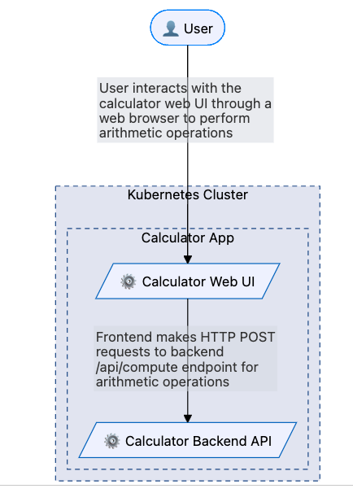
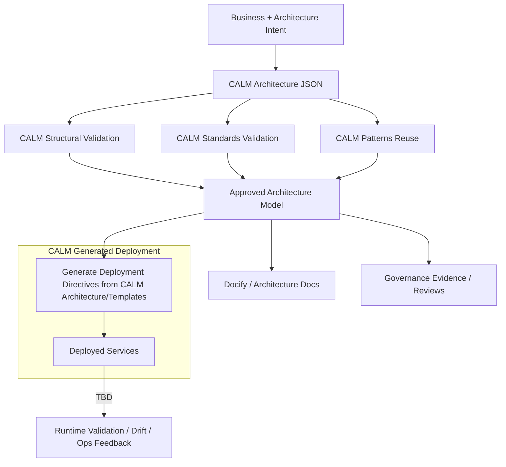
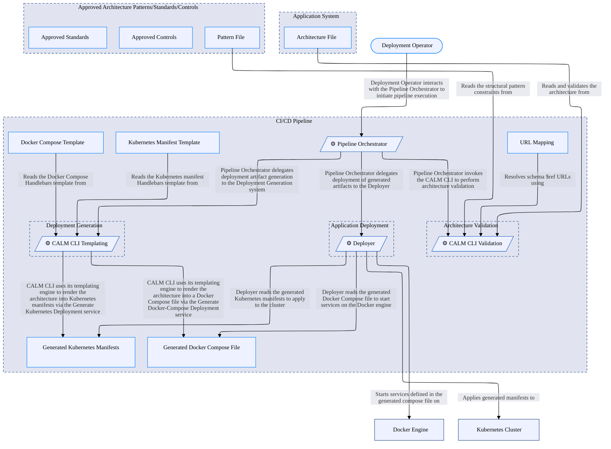
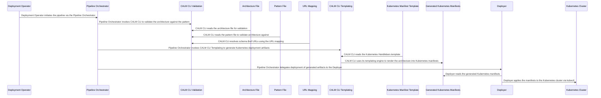
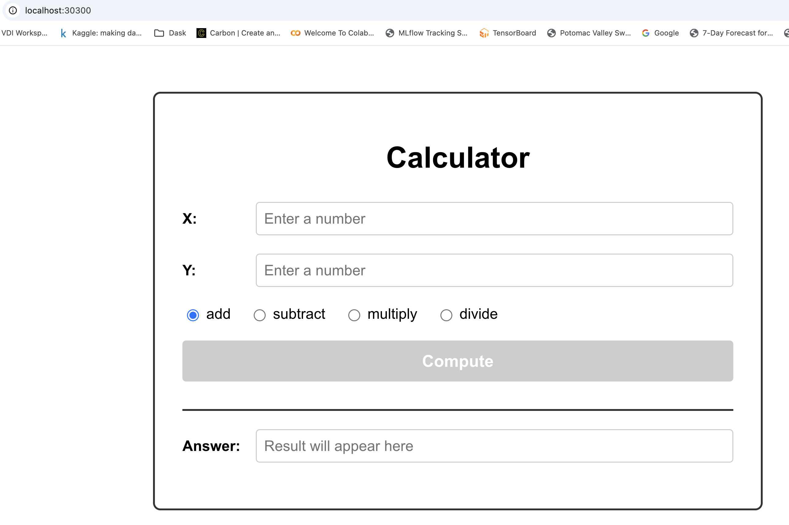
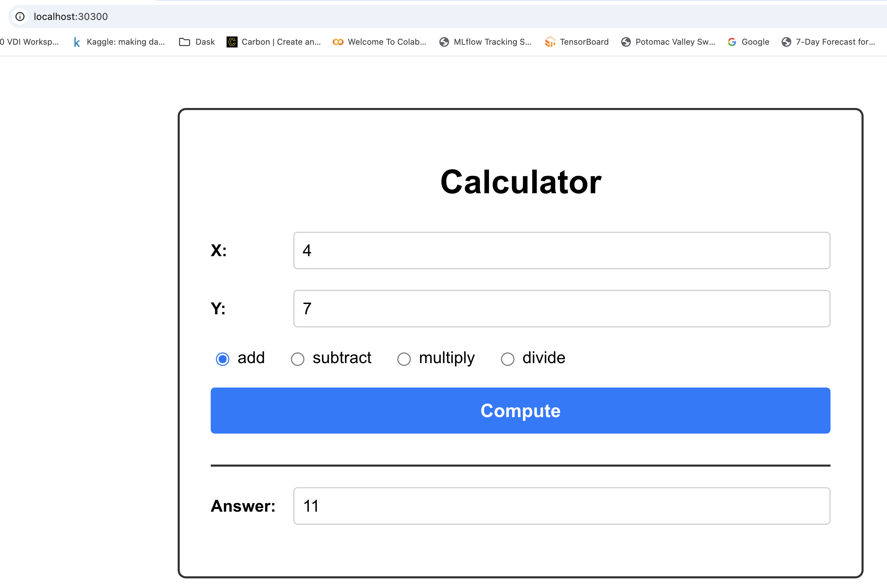
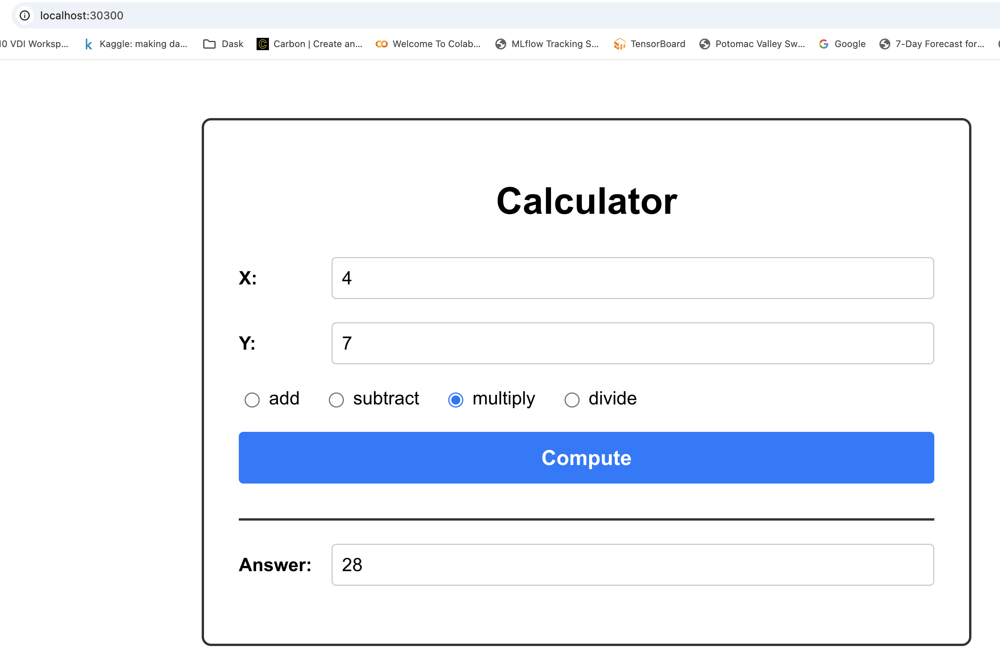

# Architecture Validation Step for CI/CD

This document describes the CI/CD validation step used in this repository. It explains how a CALM architecture JSON is validated against organizational patterns and standards, how the validated model is used to generate deployment artifacts (Kubernetes manifests or a Docker Compose stack), and how those artifacts can be integrated into CI/CD pipelines for automated validation and deployment. Intended readers: platform engineers, CI authors, and developers configuring deployment pipelines.

## Application Architecture


## CALM-Driven Deployment Flow

The following diagram illustrates possible process for generating and deploying services from a validated CALM architecture.  

- **Business & Architecture Intent**: The process begins with capturing business and architecture requirements, which are formalized as a CALM Architecture JSON document.
- **Validation Steps**: The architecture undergoes three types of validation:
  - *Structural Validation*: Ensures the architecture is structurally sound.
  - *Standards Validation*: Checks compliance with organizational or technical standards.
  - *Pattern Reuse*: Validates the use of reusable architecture patterns.
- **Approval**: Successful validation produces an approved architecture model.
- **Manifest Generation**: The approved model is used to generate Kubernetes manifests using CALM templates, ensuring infrastructure-as-code is consistent with the validated design.
- **Documentation & Governance**: Simultaneously, documentation and governance evidence are produced from the approved model.
- **Deployment**: The generated manifests are applied to the Kubernetes cluster (e.g., via `kubectl apply`), resulting in deployed services.
- **Runtime Validation & Feedback**: Operational feedback and runtime validation (such as drift detection or ops feedback) are collected from the running environment, closing the loop for continuous improvement.



To illustrate this concept, this document shows `CALM Generated Deployment` for deploying to a MacOS Desktop: 
- k8s cluster or 
- `docker-compose` services. 

For Cloud-based deployments, other tools such as Cloud Formation Templates (CFT) and HELM charts are required.  

The **key point** is that using the CALM Templating process can provide required values from the CALM architecture metadata to drive tools used for deployment.  This ensures that deployments are always traceable to validated architecture models, with automated documentation and governance, and supports feedback-driven iteration.

## CALM Architecture For Deployment

### Architecture



### Flows

#### Deploy to Kubernetes


#### Deploy to Kubernetes


## CALM-Driven Kubernetes Deployment Flow

Example CALM node metadata attributes used for k8s deployment:

```json
"metadata": {
    "k8s": {
        "image": "my-fullstack-backend:latest",
        "namespace": "my-fullstack-app",
        "replicas": 1,
        "containerPort": 8000,
        "servicePort": 8000,
        "nodePort": 30800,
        "imagePullPolicy": "IfNotPresent",
        "serviceName": "backend-service",
        "deploymentName": "backend",
        "appLabel": "backend",
        "env": [
            {
                "name": "CORS_ORIGINS",
                "value": "http://localhost:30300"
            }
        ],
        "livenessProbe": {
            "httpGet": {
                "path": "/",
                "port": 8000
            },
            "initialDelaySeconds": 10,
            "periodSeconds": 10
        },
        "readinessProbe": {
            "httpGet": {
                "path": "/",
                "port": 8000
            },
            "initialDelaySeconds": 5,
            "periodSeconds": 5
        }
    }
}
```

The [Handlebars template file](./calm/templates/k8s-manifests.yaml.hbs) to generate `k8s` maninfest file.


## CALM-Driven Docker Compose

Example CALM node metadata for `docker-compose`

```json
"metadata": {
    "docker-compose": {
        "service-name": "backend",
        "image": "my-fullstack-backend:latest",
        "ports": ["30800:8000"]
    }
}
```

The [Handlebars template file](./calm/templates/dc-compose.yaml.hbs) to generate `docker-compose` config file.

## Example Deployment Runs

When using the `calm-validate-and-deploy.sh` script you can either rely on automatic detection (it will pick the target based on metadata) or pass `--target dc` to explicitly select Docker Compose.

To illustrate this process, here are three runs of validating the architecture prior to deploying an application to a k8s cluster.  For this exercise, we defined 
- [standard for required metadata](./calm/standards/my-fullstack.standard.json) for CALM `service` nodes that are to run in a k8s cluster or `docker-compose` service
- [pattern for enforcing the required metadata standard](./calm/patterns/my-fullstack.pattern.json)
- CALM [k8s template file](./calm/templates/k8s-manifests.yaml.hbs) to generate k8s manifest file using CALM node metadata attributes.
- CALM [`docker-compose` template file](./calm/templates/dc-compose.yaml.hbs) to generate the `docker-compose` config file using CALM node metadata attributes.

### Invalid architecture

There are two issues with [this architecture](./calm/my-fullstack-invalid.architecture.json):
- Missing required metadata (docker image name) for the backend node.
- Invalid node name in a relationship

Validation is done by [this bash script](../calm-validate-and-deploy.sh).
```
$ ./calm-validate-and-deploy.sh docs/calm/my-fullstack-invalid.architecture.json 
==> Validating architecture against pattern...
Architecture: docs/calm/my-fullstack-invalid.architecture.json
Pattern: docs/calm/patterns/my-fullstack.pattern.json
URL Mapping: docs/calm/url-mapping.json

✗ CALM validation command failed!

(node:55319) [DEP0040] DeprecationWarning: The `punycode` module is deprecated. Please use a userland alternative instead.
(Use `node --trace-deprecation ...` to show where the warning was created)
info [file-system-document-loader]:     docs/calm/my-fullstack-invalid.architecture.json exists, loading as file...
info [file-system-document-loader]:     docs/calm/patterns/my-fullstack.pattern.json exists, loading as file...
info [calm-validate]:     Formatting output as json
{
    "jsonSchemaValidationOutputs": [
        {
            "code": "json-schema",
            "severity": "error",
            "message": "must have required property 'image'",
            "path": "/nodes/backend-api-service/metadata/k8s",
            "schemaPath": "https://my-fullstack-app.example.com/standards/k8s-service-metadata.json/properties/k8s/required",
            "line_start": 93,
            "line_end": 125,
            "character_start": 23,
            "character_end": 17,
            "source": "architecture"
        },
        {
            "code": "json-schema",
            "severity": "error",
            "message": "must match \"then\" schema",
            "path": "/nodes/backend-api-service",
            "schemaPath": "#/properties/nodes/items/if",
            "line_start": 64,
            "line_end": 127,
            "character_start": 8,
            "character_end": 9,
            "source": "architecture"
        }
    ],
    "spectralSchemaValidationOutputs": [
        {
            "code": "composition-relationships-reference-existing-nodes-in-architecture",
            "severity": "error",
            "message": "'backend-api-service-bad-name' does not refer to the unique-id of an existing node.",
            "path": "/relationships/calculator-app-composition/relationship-type/composed-of/nodes/1",
            "schemaPath": "",
            "line_start": 164,
            "line_end": 164,
            "character_start": 50,
            "character_end": 80,
            "source": "architecture"
        }
    ],
    "hasErrors": true,
    "hasWarnings": false
}
```

### Valid architecture - Kubernetes Deployment

This [architecture](./calm/my-fullstack-k8s.architecture.json) passes the development organization's standard for [required metadata](./calm/standards/my-fullstack.standard.json).  The standard is part of development organization's [approved pattern](./calm/patterns/my-fullstack.pattern.json).

Running [the same bash script](../calm-validate-and-deploy.sh) as before we see validation of the architecture and deployment of the application to the k8s cluster.

```
$ ./calm-validate-and-deploy.sh docs/calm/my-fullstack-k8s.architecture.json 
==> Validating architecture against pattern...
Architecture: docs/calm/my-fullstack-k8s.architecture.json
Pattern:      docs/calm/patterns/my-fullstack.pattern.json
URL Mapping:  docs/calm/url-mapping.json

✓ CALM validation passed!

Auto-detected deployment target: Kubernetes

==> Generating Kubernetes manifests...
Template: docs/calm/templates/k8s-manifests.yaml.hbs
Output:   calm-generated-k8s/all-manifests.yaml

(node:73946) [DEP0040] DeprecationWarning: The `punycode` module is deprecated. Please use a userland alternative instead.
(Use `node --trace-deprecation ...` to show where the warning was created)
info [_TemplateProcessor]:     Using SelfProvidedTemplateLoader for single template file
info [_TemplateProcessor]:     ✅ Output directory exists: /Users/jim/Desktop/calm-demos/my-fullstack-app/calm-generated-k8s
info [_TemplateProcessor]:     ℹ️ No transformer specified in index.json. Will use TemplateDefaultTransformer.
info [_TemplateProcessor]:     🔁 No transformer provided. Using TemplateDefaultTransformer.
Failed to dereference Resolvable: #cors-policy Composite resolver: Unable to resolve reference #cors-policy
info [_TemplateEngine]:     ✅ Compiled 1 Templates
info [_TemplateEngine]:     🔧 Registering Handlebars Helpers...
info [_TemplateEngine]:     ✅ Registered helper: eq
info [_TemplateEngine]:     ✅ Registered helper: lookup
info [_TemplateEngine]:     ✅ Registered helper: json
info [_TemplateEngine]:     ✅ Registered helper: instanceOf
info [_TemplateEngine]:     ✅ Registered helper: kebabToTitleCase
info [_TemplateEngine]:     ✅ Registered helper: kebabCase
info [_TemplateEngine]:     ✅ Registered helper: isObject
info [_TemplateEngine]:     ✅ Registered helper: isArray
info [_TemplateEngine]:     ✅ Registered helper: join
info [_TemplateEngine]:     
🔹 Starting Template Generation...
info [_TemplateEngine]:     ✅ Generated: /Users/jim/Desktop/calm-demos/my-fullstack-app/calm-generated-k8s/all-manifests.yaml
info [_TemplateEngine]:     
✅ Template Generation Completed!
info [_TemplateProcessor]:     
✅ Template Generation Completed!
✓ Kubernetes manifests generated successfully!

==> Applying Kubernetes manifests...
Running: kubectl apply -f calm-generated-k8s/all-manifests.yaml

deployment.apps/frontend created
service/frontend-service created
deployment.apps/backend created
service/backend-service created

✓ Deployment successful!

Summary:
  • Architecture validated: docs/calm/my-fullstack-k8s.architecture.json
  • Manifests generated:    calm-generated-k8s/all-manifests.yaml
  • Kubernetes resources applied

NAME                       READY   UP-TO-DATE   AVAILABLE   AGE
deployment.apps/backend    0/1     1            0           0s
deployment.apps/frontend   0/1     1            0           0s

NAME                       TYPE       CLUSTER-IP       EXTERNAL-IP   PORT(S)          AGE
service/backend-service    NodePort   10.107.125.123   <none>        8000:30800/TCP   0s
service/frontend-service   NodePort   10.96.139.122    <none>        80:30300/TCP     0s


$ k-get deploy -n my-fullstack-app
NAME       READY   UP-TO-DATE   AVAILABLE   AGE
backend    1/1     1            1           44s
frontend   1/1     1            1           44s

$ k-get services -n my-fullstack-app
NAME               TYPE       CLUSTER-IP       EXTERNAL-IP   PORT(S)          AGE
backend-service    NodePort   10.107.125.123   <none>        8000:30800/TCP   51s
frontend-service   NodePort   10.96.139.122    <none>        80:30300/TCP     51s

```

### Valid architecture - Docker-Compose

This [architecture](./calm/my-fullstack-dc.architecture.json) passes the development organization's standard for [required metadata](./calm/standards/my-fullstack.standard.json).  The standard is part of development organization's [approved pattern](./calm/patterns/my-fullstack.pattern.json).

Running [the same bash script](../calm-validate-and-deploy.sh) as before we see validation of the architecture and deployment of the application to the k8s cluster.

```
$ ./calm-validate-and-deploy.sh docs/calm/my-fullstack-dc.architecture.json 
==> Validating architecture against pattern...
Architecture: docs/calm/my-fullstack-dc.architecture.json
Pattern:      docs/calm/patterns/my-fullstack.pattern.json
URL Mapping:  docs/calm/url-mapping.json

✓ CALM validation passed!

Auto-detected deployment target: Docker Compose

==> Generating Docker Compose file...
Template: docs/calm/templates/dc-compose.yaml.hbs
Output:   calm-generated-dc/docker-compose.yml

(node:77500) [DEP0040] DeprecationWarning: The `punycode` module is deprecated. Please use a userland alternative instead.
(Use `node --trace-deprecation ...` to show where the warning was created)
info [_TemplateProcessor]:     Using SelfProvidedTemplateLoader for single template file
info [_TemplateProcessor]:     ✅ Output directory exists: /Users/jim/Desktop/calm-demos/my-fullstack-app/calm-generated-dc
info [_TemplateProcessor]:     ℹ️ No transformer specified in index.json. Will use TemplateDefaultTransformer.
info [_TemplateProcessor]:     🔁 No transformer provided. Using TemplateDefaultTransformer.
Failed to dereference Resolvable: #cors-policy Composite resolver: Unable to resolve reference #cors-policy
info [_TemplateEngine]:     ✅ Compiled 1 Templates
info [_TemplateEngine]:     🔧 Registering Handlebars Helpers...
info [_TemplateEngine]:     ✅ Registered helper: eq
info [_TemplateEngine]:     ✅ Registered helper: lookup
info [_TemplateEngine]:     ✅ Registered helper: json
info [_TemplateEngine]:     ✅ Registered helper: instanceOf
info [_TemplateEngine]:     ✅ Registered helper: kebabToTitleCase
info [_TemplateEngine]:     ✅ Registered helper: kebabCase
info [_TemplateEngine]:     ✅ Registered helper: isObject
info [_TemplateEngine]:     ✅ Registered helper: isArray
info [_TemplateEngine]:     ✅ Registered helper: join
info [_TemplateEngine]:     
🔹 Starting Template Generation...
info [_TemplateEngine]:     ✅ Generated: /Users/jim/Desktop/calm-demos/my-fullstack-app/calm-generated-dc/docker-compose.yml
info [_TemplateEngine]:     
✅ Template Generation Completed!
info [_TemplateProcessor]:     
✅ Template Generation Completed!
✓ Docker Compose file generated successfully!

==> Validating generated Docker Compose file...
WARN[0000] /Users/jim/Desktop/calm-demos/my-fullstack-app/calm-generated-dc/docker-compose.yml: the attribute `version` is obsolete, it will be ignored, please remove it to avoid potential confusion 
name: calm-generated-dc
services:
  backend:
    image: my-fullstack-backend:latest
    networks:
      default: null
    ports:
      - mode: ingress
        target: 8000
        published: "30800"
        protocol: tcp
  frontend:
    depends_on:
      backend:
        condition: service_started
        required: true
    image: my-fullstack-frontend:latest
    networks:
      default: null
    ports:
      - mode: ingress
        target: 80
        published: "30300"
        protocol: tcp
networks:
  default:
    name: calm-generated-dc_default
✓ Docker Compose file is valid!

==> Starting services with Docker Compose...
Running: docker compose -f calm-generated-dc/docker-compose.yml up -d

WARN[0000] /Users/jim/Desktop/calm-demos/my-fullstack-app/calm-generated-dc/docker-compose.yml: the attribute `version` is obsolete, it will be ignored, please remove it to avoid potential confusion 
[+] up 3/3
 ✔ Network calm-generated-dc_default      Created                                                            0.0s
 ✔ Container calm-generated-dc-backend-1  Started                                                            0.1s
 ✔ Container calm-generated-dc-frontend-1 Started                                                            0.1s

✓ Deployment successful!

Summary:
  • Architecture validated: docs/calm/my-fullstack-dc.architecture.json
  • Compose file generated: calm-generated-dc/docker-compose.yml
  • Services started via Docker Compose


$ docker compose -f calm-generated-dc/docker-compose.yml ps
WARN[0000] /Users/jim/Desktop/calm-demos/my-fullstack-app/calm-generated-dc/docker-compose.yml: the attribute `version` is obsolete, it will be ignored, please remove it to avoid potential confusion 
NAME                           IMAGE                          COMMAND                  SERVICE    CREATED         STATUS         PORTS
calm-generated-dc-backend-1    my-fullstack-backend:latest    "uvicorn src.main:ap…"   backend    3 minutes ago   Up 3 minutes   0.0.0.0:30800->8000/tcp, [::]:30800->8000/tcp
calm-generated-dc-frontend-1   my-fullstack-frontend:latest   "/docker-entrypoint.…"   frontend   3 minutes ago   Up 3 minutes   0.0.0.0:30300->80/tcp, [::]:30300->80/tcp
```

## Screenshots of My Fullstack App 

**Initial Web Page**


**First Computation**


**Second Computation**

