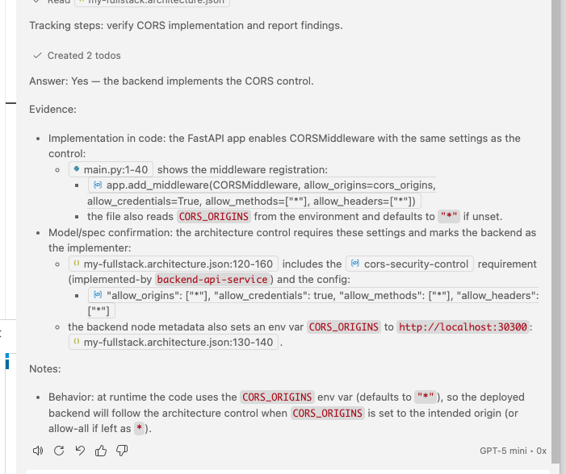

## Github Copilot Chat Log

**User**: does the backend service comply with the CORS control.  If yes, cite where in the source model this is enforced.  If no, cite why.

**GitHub Copilot**: I'll search the backend source for CORS configuration to validate the control.

Searched for regex `CORS|cors|COR S|allow_origins|allow_origins|COR S_ORIGINS|CORS_ORIGINS` (`**/backend/**`), 20 results

I'll open the backend main.py to cite the CORS configuration lines.

Read 

I'll open the architecture JSON to cite the control and backend env configuration.

Read 

Tracking steps: verify CORS implementation and report findings.

Created 2 todos

Answer: Yes — the backend implements the CORS control.

Evidence:
- Implementation in code: the FastAPI app enables CORSMiddleware with the same settings as the control:
  - main.py shows the middleware registration:
    - `app.add_middleware(CORSMiddleware, allow_origins=cors_origins, allow_credentials=True, allow_methods=["*"], allow_headers=["*"])`
    - the file also reads `CORS_ORIGINS` from the environment and defaults to `"*"` if unset.
- Model/spec confirmation: the architecture control requires these settings and marks the backend as the implementer:
  - my-fullstack-k8s.architecture.json includes the `cors-security-control` requirement (implemented-by `backend-api-service`) and the config:
    - `"allow_origins": ["*"], "allow_credentials": true, "allow_methods": ["*"], "allow_headers": ["*"]`
  - the backend node metadata also sets an env var `CORS_ORIGINS` to `http://localhost:30300`: my-fullstack-k8s.architecture.json.

**Screenshot**

Notes:
- Behavior: at runtime the code uses the `CORS_ORIGINS` env var (defaults to `"*"`), so the deployed backend will follow the architecture control when `CORS_ORIGINS` is set to the intended origin (or allow-all if left as `*`).